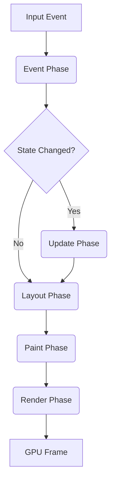

# Architecture

Felt UI is a high-performance, GPU-accelerated UI engine. It combines the ergonomics of a declarative, fluent API (inspired by GPUI) with the performance of a retained-mode render tree.

## High-Level API: Declarative Composition

Developers build UIs using a fluent, builder-pattern API. Elements are composed into a tree which the engine diffs and renders.

### Example: The View
Views are the building blocks of the application. They implement a `render` method.

```rust
app.mount_ui(move || {
    div()
        .size(Size::FULL)
        .bg(Colors::WHITE)
        .child(
            div()
                .w_half()
                .child(render_sidebar())
        )
        .child(
            div()
                .w_half()
                .child(render_main_content())
        )
});
```

## Reactivity & State Management

Felt UI adopts a hybrid reactivity model inspired by **SolidJS** for fine-grained UI updates and **Zustand** for global state management.

### Fine-Grained Reactivity (SolidJS-inspired)
UI components react to state changes using Signals and Effects. This allows for precise updates without re-rendering the entire component tree.

#### Signals
Signals are the basic units of state. They hold a value and notify subscribers when that value changes. The type must implement `Hash` for efficient change detection via hash comparison.

```rust
// Creating a signal (T must implement Hash + Clone)
let (count, set_count) = create_signal::<i32>(0);

// Reading a signal (subscribes the current context)
let current_count = count.get();

// Updating a signal (only notifies if hash changes)
set_count.set(current_count + 1);

// For complex types
#[derive(Clone, Hash, PartialEq)]
struct User {
    id: u64,
    name: String,
}

let (user, set_user) = create_signal(User { id: 1, name: "Alice".into() });
```

**Signal Implementation Algorithm:**

The Signal internally maintains both the value and its hash for efficient change detection:

```rust
pub struct Signal<T: Hash + Clone> {
    value: Arc<RwLock<T>>,
    hash: Arc<RwLock<u64>>,
    subscribers: Arc<RwLock<Vec<SubscriberId>>>,
}

impl<T: Hash + Clone> Signal<T> {
    pub fn new(initial: T) -> Self {
        let mut hasher = DefaultHasher::new();
        initial.hash(&mut hasher);
        let initial_hash = hasher.finish();
        
        Self {
            value: Arc::new(RwLock::new(initial)),
            hash: Arc::new(RwLock::new(initial_hash)),
            subscribers: Arc::new(RwLock::new(Vec::new())),
        }
    }
    
    pub fn get(&self) -> T {
        // Track this signal as a dependency of the current reactive context
        track_dependency(self.id());
        self.value.read().unwrap().clone()
    }
    
    pub fn set(&self, new_value: T) {
        // 1. Compute hash of new value
        let mut hasher = DefaultHasher::new();
        new_value.hash(&mut hasher);
        let new_hash = hasher.finish();
        
        // 2. Compare with stored hash (fast O(1) comparison)
        let old_hash = *self.hash.read().unwrap();
        
        if new_hash != old_hash {
            // 3. Only update if hash changed
            *self.value.write().unwrap() = new_value;
            *self.hash.write().unwrap() = new_hash;
            
            // 4. Notify subscribers
            let subscribers = self.subscribers.read().unwrap();
            for subscriber_id in subscribers.iter() {
                schedule_effect(*subscriber_id);
            }
        }
        // If hash is the same, do nothing (no notifications, no updates)
    }
}
```

**Performance Benefits:**
- **O(1) hash comparison** vs O(n) deep equality for complex types
- Prevents cascade re-renders when setting the same value
- Works seamlessly with derived types (enums, structs with many fields)

#### Effects
Effects are side effects that run when their dependencies change. They automatically track which signals are accessed.

```rust
create_effect(move || {
    // This closure re-runs whenever `count` changes
    println!("The count is now: {}", count.get());
});

// Effects can depend on multiple signals
create_effect(move || {
    let u = user.get();
    let c = count.get();
    println!("User {} has count {}", u.name, c);
});
```

#### Derived State
Computed values update automatically when their dependencies change.

```rust
let double_count = move || count.get() * 2;
```

#### Binding to UI
Signals can be directly bound to UI properties.

```rust
div()
    .bg(move || if count.get() > 5 { Colors::RED } else { Colors::BLUE })
    .on_click(move |_| set_count.update(|c| c + 1))
```

### Global State Store (Zustand-inspired)
For application-wide state, Felt provides a centralized store with a reducer-like pattern, but simplified.

#### Store Definition
Define your state struct and the initial state. All state types must implement `Hash` for efficient change detection.

```rust
#[derive(Clone, Debug, Hash, PartialEq)]
struct AppState {
    user: Option<User>,
    theme: Theme,
    notifications: Vec<String>,
}

#[derive(Clone, Debug, Hash, PartialEq)]
struct User {
    id: u64,
    name: String,
}

#[derive(Clone, Copy, Debug, Hash, PartialEq)]
enum Theme {
    Light,
    Dark,
}

impl Default for AppState {
    fn default() -> Self {
        Self {
            user: None,
            theme: Theme::Light,
            notifications: Vec::new(),
        }
    }
}
```

#### Actions
Actions are functions that mutate the store. They can be methods on a `Store` wrapper or standalone functions.

```rust
impl AppState {
    fn login(&mut self, user: User) {
        self.user = Some(user);
    }

    fn toggle_theme(&mut self) {
        self.theme = match self.theme {
            Theme::Light => Theme::Dark,
            Theme::Dark => Theme::Light,
        };
    }
}
```

#### Usage in Components
Components subscribe to specific slices of the store using selectors. The selected value must implement `Hash` for efficient change detection. This ensures they only re-render when that specific slice changes.

```rust
// Subscribe to the user slice (Option<User> must implement Hash)
let user = use_store(|state: &AppState| state.user.clone());

// Subscribe to the theme slice (Theme must implement Hash)
let theme = use_store(|state: &AppState| state.theme);

// For derived/computed values, ensure the result type implements Hash
#[derive(Clone, Hash, PartialEq)]
enum UserStatus {
    LoggedIn(String),
    LoggedOut,
}

let user_status = use_store(|state: &AppState| {
    match &state.user {
        Some(u) => UserStatus::LoggedIn(u.name.clone()),
        None => UserStatus::LoggedOut,
    }
});

div()
    .bg(move || match theme.get() {
        Theme::Light => Colors::WHITE,
        Theme::Dark => Colors::BLACK,
    })
    .child(
        text(move || match user.get() {
            Some(u) => format!("Welcome, {}", u.name),
            None => "Please log in".to_string(),
        })
    )
```

### Reactivity Execution Model

The reactivity system drives the UI update loop, ensuring that only the necessary parts of the UI are re-computed and re-rendered.

#### 1. Dependency Tracking
When a Signal is accessed (e.g., via `.get()`) within an **Effect** or a **UI binding closure**, the running effect is automatically registered as a *subscriber* to that Signal. This creates a dynamic dependency graph.

#### 2. Hash-Based Change Detection
All reactive values must implement `Hash` for efficient change detection:
- When a Signal's value is updated via `.set()`, the framework computes the hash of the new value.
- This hash is compared with the hash of the previous value.
- **Only if the hashes differ** are subscribers notified, preventing unnecessary re-renders.
- This is significantly faster than deep equality checks for complex types.

```rust
// Example: Only notifies if the hash changes
let (user, set_user) = create_signal(User { id: 1, name: "Alice".into() });

// This will notify subscribers (hash changes)
set_user.set(User { id: 1, name: "Bob".into() });

// This will NOT notify subscribers (same hash as previous)
set_user.set(User { id: 1, name: "Bob".into() });
```

#### 3. Change Notification
When a hash mismatch is detected, the Signal notifies all its subscribers.

#### 4. Effect Scheduling
Notified Effects are scheduled to run.
-   **Synchronous**: Simple effects may run immediately.
-   **Batching**: To avoid unnecessary work, multiple signal updates within a single event loop tick can be batched, running effects only once.

#### 5. UI Updates & Rendering
The reactivity system integrates tightly with the rendering pipeline:
-   **Property Updates**: If a Signal is bound to a property (e.g., `bg`, `width`), the element's internal state is updated directly.
-   **Dirty Marking**: If the property affects layout or visual appearance, the element marks itself as "dirty" (e.g., `needs_layout` or `needs_paint`).
-   **Frame Request**: The engine is notified to schedule a new frame.
-   **Render Phase**: In the next frame, the engine traverses the tree, re-calculating layout and re-painting only the dirty nodes and their affected ancestors/descendants.

## Core System: The Engine

Under the hood, these declarative elements produce a persistent tree of `Widget`s.

### The Widget Trait
The `Widget` trait is the low-level interface that powers the elements.

```rust
pub trait Widget {
    fn on_event(&mut self, ctx: &mut EventCtx, event: &Event);
    fn layout(&mut self, ctx: &mut LayoutCtx, bc: &BoxConstraints) -> Size;
    fn paint(&mut self, ctx: &mut PaintCtx, scene: &mut Scene);
    fn children(&self) -> SmallVec<[EntityId; 4]>;
}
```

## The Pipeline



## Rendering Model: Canvas, Clipping, and Scrolling

Felt leverages Vello's powerful 2D rendering capabilities.

### Clipping & Layers (ScrollView Implementation)
The `ScrollView` element works by pushing a clip layer onto the Vello scene.

```rust
// The low-level implementation of the ScrollView widget
impl Widget for ScrollView {
    fn paint(&mut self, ctx: &mut PaintCtx, scene: &mut Scene) {
        let viewport = Rect::from_origin_size(Point::ORIGIN, ctx.size());
        
        // 1. Push Clip Layer
        scene.push_layer(Mix::Normal, 1.0, Affine::IDENTITY, &viewport);

        // 2. Push Scroll Transform
        scene.push_layer(Mix::Normal, 1.0, Affine::translate(self.offset), &viewport);

        // 3. Paint Children
        for child in self.children() {
            ctx.paint_child(child, scene);
        }

        // 4. Pop Layers
        scene.pop_layer();
        scene.pop_layer();
    }
}
```

### Custom Drawing (Canvas Implementation)
For custom visualization, you can use the `canvas` element to drop down to low-level drawing with a closure.

```rust
canvas(move |ctx, scene| {
    // We are already in the correct coordinate space (transformed and clipped)
    // thanks to the parent widgets (like ScrollView).
    
    scene.fill(
        Fill::NonZero, 
        ctx.transform, 
        &Brush::Solid(Color::RED), 
        None, 
        &rect
    );
})
.size(Size::FULL) // The canvas element acts like a normal box for layout
```

## Animation & Real-time Updates

Felt is designed for high-frequency updates (60-120Hz).

### The Threading Model
To achieve smooth performance, Felt separates the **recording** of drawing commands from their **execution**.

1.  **Main Thread (Recording)**:
    -   Runs the application logic, event handling, and layout.
    -   Executes the `canvas` closures.
    -   **Crucial**: This thread only *records* lightweight commands into the Vello `Scene`. It does **not** do rasterization or heavy GPU work. This ensures that even complex scenes can be recorded in a fraction of a frame.

2.  **Render Thread (Execution)**:
    -   Takes the immutable `Scene` produced by the Main Thread.
    -   Performs Vello's fine rasterization (on GPU via compute shaders) and command encoding.
    -   Submits work to the GPU.

## Subsystems

### Text Engine (Parley)
Text is a first-class citizen.
-   **Declarative**: `text("Hello World").font_size(16.0)`
-   **Implementation**: The `Text` widget holds a `parley::Layout` cache and issues glyph draw commands to Vello.

### Accessibility (AccessKit)
-   **Tree Sync**: The declarative tree is diffed to update the AccessKit tree.
-   **Semantics**: Elements can be annotated: `div().role(Role::Button).aria_label("Submit")`.
